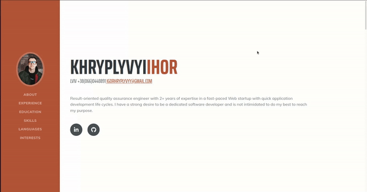

 

# **Hi there, my name is Ihor** :wave:

### I am a result-oriented quality assurance engineer with 2+ years of expertise in a fast-paced Web startup with quick application development life cycles, and software testing in general. Also, I have a solid understanding of software product lifecycle and main AGILE techniques.

 

# **Latest Experience**

- ### QA engineer at "Rolique"

#### _March 2020 – August 2021_

- ### QC engineer and system configurator at "EveryMatrix"

#### _July 2019 – February 2020_

- ### Manual tester at "Testbirds"

#### _June 2019 – May 2021_

 

### You can **contact** me via [LinkedIn](https://www.linkedin.com/in/khryplyvyi/) or mail me at igorhryplyvyy@gmail.com

 

# **Favorite Tech**

<table>
  <tr>
     <td align="center" width="96">
      
       HTML5
    </td>
       <td align="center" width="96">
      
       CSS3
    </td>
      <td align="center" width="96">
      
       Postman
    </td>
      <td align="center" width="96">
      
       Apache Jmeter
    </td>
     <td align="center" width="96">
      
       JavaScript
    </td>
    <td align="center" width="96">
      
       SQL
    </td>
  </tr>
  </table>
   

# **Skills Summary**

## API testing

- ### _Postman_

## Performance testing

- ### _Apache JMeter, Chronograf, InfluxDB_

## Task and Test Management Tools

- ### _Jira, TestRail, Mantis, Trello_

## Automation testing tools

- ### _Python/Webdriver, Katalon ( **I'm very keen of to learn automation testing with JS and would be glad to get such an opportunity**)_

## Additional skills

- ### _Basic knowledge of algorithms, experienced Linux user, skilled in Photoshop, GIT, experience with React, strong understanding of MVC design pattern_

 

# **Languages**

- ## Ukrainian - native
- ## Russian - fluent (but isn't preferable one)
- ## English - upper intermediate
- ## Polish - beginner

# Projects that might interest you

**CV App**

Fully functional, responsive CV app, created in React.

[Live link](https://resume-app-react.herokuapp.com/) | [Repository](https://github.com/Yhortimer/cv-app-react)

 

>
 

### You can **contact** me via [LinkedIn](https://www.linkedin.com/in/khryplyvyi/) or mail me at igorhryplyvyy@gmail.com

 
