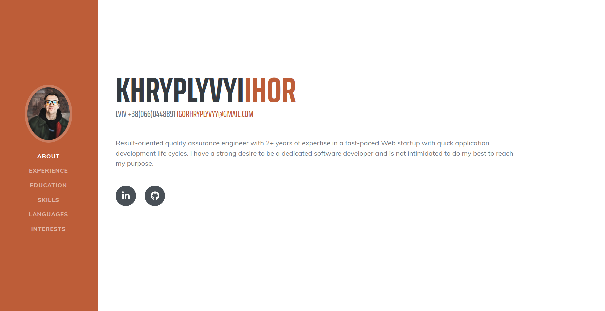

# **Hi there, I'm Ihor** :wave:

Currently I'm looking for my first job as **frontend developer**. There is a list of some my skills bellow.

 

You can **contact** me via [LinkedIn](https://www.linkedin.com/in/khryplyvyi/) or mail me at igorhryplyvyy@gmail.com

 

## **Favorite Tech**

<table>
  <tr>
     <td align="center" width="96">
      
       HTML5
    </td>
       <td align="center" width="96">
      
       CSS3
    </td>
      <td align="center" width="96">
      
       Sass
    </td>
     <td align="center" width="96">
      
       JavaScript
    </td>
    <td align="center" width="96">
      
       React
    </td>
  </tr>
  </table>
   

## Projects that might interest you

**CV App**

Fully functional, responsive CV app, created in React.

[Live link](https://resume-app-react.herokuapp.com/) | [Repository](https://github.com/Yhortimer/cv-app-react)

 

